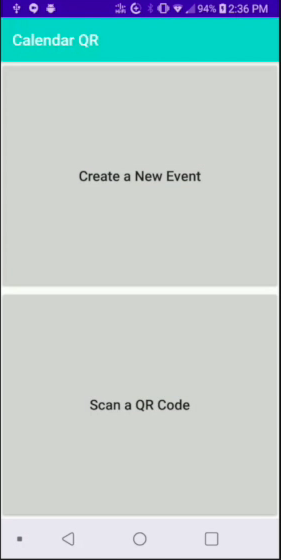
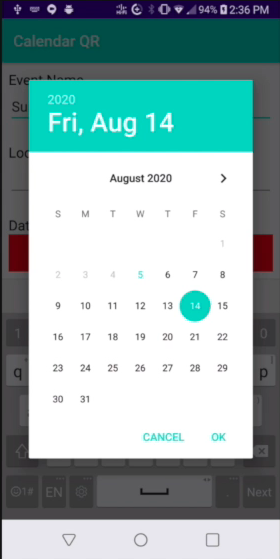
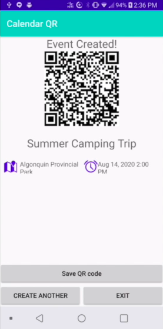
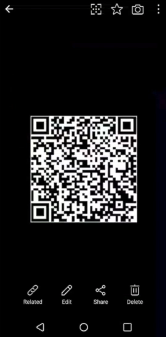
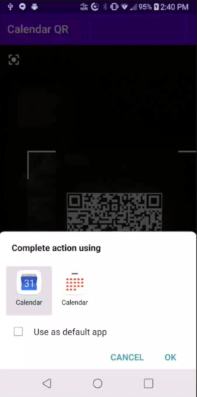
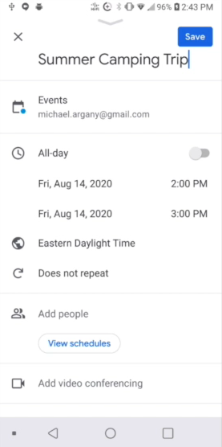

# Application
Calendar QR is an Android application. It allows event planners to generate and share event information in the form of a QR code. End users would then be able to scan this code and automatically add the event to their Google Calendar.

| Main Page      | Creating an Event      |
|----------------------------|----------------------------|
|  |  |

| Event QR Code      | Save to Local      |
|----------------------------|----------------------------|
|  |  |

| Add to Calendar      | Edit in Google Calendar      |
|----------------------------|----------------------------|
|  |  |
